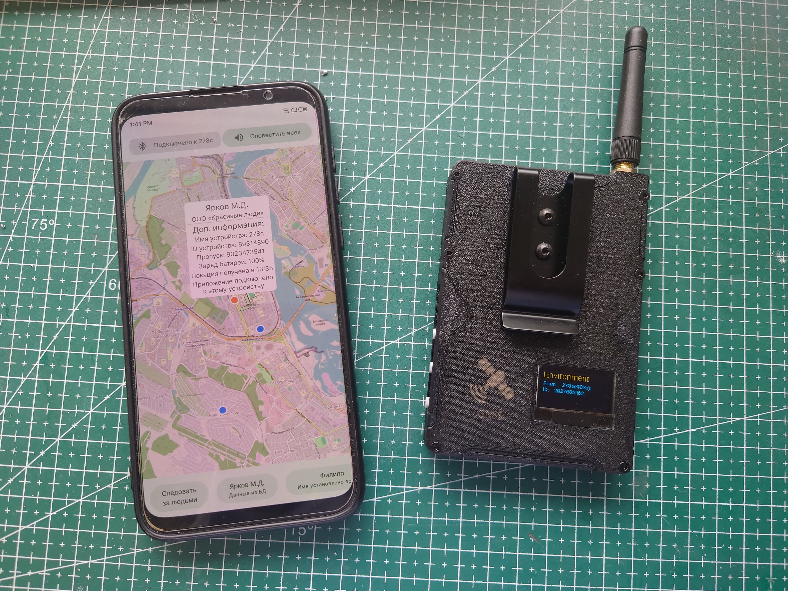
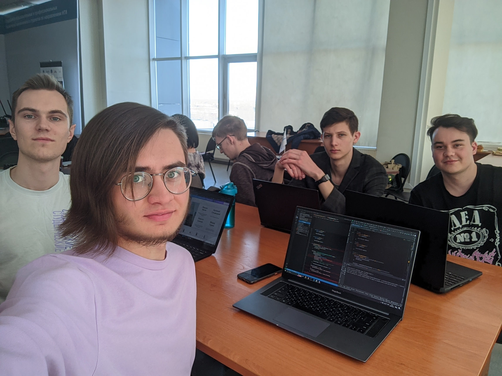

<h1 align="center">

hi, it's mxkmn pronounced [mʌksikɔma:n]

</h1>

Nowadays and next years I'm an Android developer, also like to play with microcontrollers and bring their benefits to business. Writes lots of useful Android stuff on [StackOverflow](https://stackoverflow.com/users/12544067/mxkmn?tab=answers).

<b>My latest&greatest projects</b>

---

||chronus|[news at ](https://t.me/chronusapp)|[download on ](https://play.google.com/store/apps/details?id=mxkmn.chronus)|
|:-:|:-:|:-:|:-:|

https://github.com/user-attachments/assets/68fcfb1c-24e9-4ce6-aef1-417f1f566e2e

Just the best university timetable app in the world. It automatically adds schedule to the Android pre-installed calendar, allowing it to be displayed in any widget or on a smartwatches. Works by parsing web pages and automatically synronises data several times a day.

|Stack|
|:-:|

* UI: Compose; Compose Navigation; Material3; Splashscreen API; Dynamic theming on Android 8.1+; [Self-written compose permissions handling](https://stackoverflow.com/questions/60608101/how-request-permissions-with-jetpack-compose/77027650#77027650); Notifications.
* Architecture: Multimodule; Single Activity; MVI/UDF/Clean Architecture with Jetpack ViewModel and Kotlin Flows; Coroutines; Dagger Hilt.
* Network and connections: [WorkManager](https://stackoverflow.com/a/77812387/12544067); Calendar Provider (ContentResolver); JSoup; Ktor Client; Kotlin Serialization.
* Local memory: Room; DataStore.
* Tools and testing: Baseline/Startup Profiles; Tracer by OK.Tech; Detekt; KtLint; Gradle convention plugins.

|Additional info|
|:-:|

Hated WorkManager, check my story at StackOverflow (follow the link by clicking on WorkManager above).

---

||Offline tracker|
|:-:|:-:|

An application to track people in an area without internet coverage. Receives data from trackers via BLE (they locate with GPS and communicate via LoRa in a mesh network), which were developed with me. Offline-first approach. Application developed entirely by me on behalf of the Irkutsk Oil Company.

|Stack|
|:-:|

* UI: Compose; Material3; Splashscreen API; [Self-written compose permissions handling](https://stackoverflow.com/questions/60608101/how-request-permissions-with-jetpack-compose/77027650#77027650); OpenStreetMap with Osmdroid library.
* Architecture: Multimodule approach in monorepository for all Irkutsk Oil projects; Single Activity; MVI/UDF/Clean Architecture with Jetpack ViewModel and Kotlin Flows; Coroutines; Dagger Hilt.
* Network and connections: Ktor Client; Kotlin Serialization; [Bluetooth LE](https://stackoverflow.com/questions/78731848/how-do-i-make-a-ble-connection-to-a-peripheral-with-kotlin-multiplatform-or-nati/78731849#78731849); Protobufs (to use extended Meshtastic protocol).
* Local memory: Room.
* Tools and testing: Tracer by OK.Tech; Detekt; KtLint; Gradle convention plugins; MockK; Compose Tests.

|Migrations since project start|
|:-:|

* Singlemodule -> Multimodule;
* Default repository -> Monorepo for Irkutsk Oil;
* Google Maps (Maps Compose library) -> Google Maps (Views) -> OpenStreetMap via Osmdroid library (Views);
* BLE via pure Android SDK -> Kable lib;
* Self-made firmware for microcontroller -> [Meshtastic](https://meshtastic.org/) based modified firmware (so I had to understand the workings of Meshtastic's Protobuf-based communication protocol without documentation);
* Network connections via pure OkHttp -> Ktor Client;
* Accompanist permissions handling -> Self-written permissions handling for Compose;
* Gradle with Groovy -> Gradle with Kotlin and Gradle convention plugins;
* Firebase Crashlytics/Analytics -> Tracer ([adv](https://apptracer.ru/doc/about)an[ced](https://habr.com/ru/companies/vk/articles/757416/) crashlytic and monitoring service).

|Additional info|
|:-:|

Thanks to experience, I now know that GMaps for Compose is very unstable and it makes sense to use an implementation of all actions via View and an additional class to abstract the map capabilities. Migrated to OSM at the request of the customer.

Also it's my graduation work:

|[Graduation work (RU)](pdfs/graduation_work/work.pdf)|[Presentation (RU)](pdfs/graduation_work/presentation_ru.pdf)|[Presentation (EN)](pdfs/graduation_work/presentation_en.pdf)|
|:-:|:-:|:-:|

---

||Laundry accounting|
|:-:|:-:|

An application for linen accounting in laundries. Receives employee data from an RFID scanner via BLE, which was developed in team with me. Offline-first approach. Developed completely by me by order of Irkutsk Oil Company.

|Stack|
|:-:|

* UI: Compose; Compose Navigation; Material3; Splashscreen API; [Self-written compose permissions handling](https://stackoverflow.com/questions/60608101/how-request-permissions-with-jetpack-compose/77027650#77027650).
* Architecture: Multimodule approach in monorepository for all Irkutsk Oil projects; Single Activity; MVI/UDF/Clean Architecture with Jetpack ViewModel and Kotlin Flows; Coroutines; Dagger Hilt.
* Network and connections: Ktor Client; Kotlin Serialization; [Bluetooth LE](https://stackoverflow.com/questions/78731848/how-do-i-make-a-ble-connection-to-a-peripheral-with-kotlin-multiplatform-or-nati/78731849#78731849).
* Local memory: Room; DataStore; [Storage Access Framework](https://stackoverflow.com/questions/64720379/writing-many-files-on-android-11/77087157#77087157); [.xlsx creation](https://stackoverflow.com/questions/50738119/how-to-create-and-write-to-excel-file-xlsx/77171826#77171826).
* Tools and testing: Detekt; KtLint; Gradle convention plugins.

|Additional info|
|:-:|

As this was the second project for Irkutsk Oil Company, a monorepository was established for all current and future projects, which increased development speed by times and greatly improved code quality and component reusability.

---

|In not presented projects also worked with|
|:-:|

* UI: XML with Fragments; Navigation Component; Material2; View Binding.
* Architecture: Foreground Services; MVVM; LiveData; Dagger 2.
* Network and connections: Retrofit; GSON serialization; WorkManager; GPS via Fused Location Provider.
* Tools, testing and other: Mockito; Espresso; iBeacon.

---

<b>Some fun stuff</b>

---

### At Summer Schools 2022 by Yandex Academy

### At MDev Hackathon 2023 by Samsung IT Academy

We've got [max rating](https://github.com/mxkmn/HackathonAndroidBlindy?tab=readme-ov-file#result), but 2nd place :/

### My [weather station](https://github.com/mxkmn/Esp8266WeatherStation/blob/main/README_ru.md)

Built almost from scratch in 2021. It's cool, but I want to rebuild it again (to use new MCU and support RTOS features, make it smaller and also rewrite some crappy code).

### With [Vlad Savin](https://t.me/VladSavin) at the punk garage "Glotka" (2023)

---

<b>My experience and statistics</b>

I've worked as an individual and as a team developer in a startup and small outstaff studio.

As a student participated in 9 hackathons, taking 2nd place twice and 3rd place four times. One day I'll get the first, hopefully.

Loving coding since 2015, professionally since 2021. [My CV (RU)](pdfs/cv.pdf)

---

Last days from [my Code::Stats](https://codestats.net/users/mxkmn):

## Some interests beyond development

<b>Music&sound</b>

Because everyone likes it and writes about on personal pages 🥱.

So, if you want to know about my taste in melodic screamo kircore rap: [Deezer profile](http://deezer.com/en/profile/4884764102). Or just click on your ultra-random button: [a](https://www.youtube.com/watch?v=bIgBj-G1Vj0) [b](https://www.youtube.com/watch?v=PE3UMiIUaXY) [c](https://www.youtube.com/watch?v=6Gha9xrM10w) [d](https://www.youtube.com/watch?v=JiQHclg_648) [e](https://www.youtube.com/watch?v=wobbf3lb2nk) [f](photos/my_foot.jpg) [g](https://www.youtube.com/watch?v=iVvXB-Vwnco) [h](https://www.youtube.com/watch?v=xuhZtyAwBdE) [i](https://www.youtube.com/watch?v=8dnJpuWuGn8) [j](https://www.youtube.com/watch?v=Yt0kHiRsnHA) [k](https://www.youtube.com/watch?v=t_gRKiXg3Ao) [l](https://www.youtube.com/watch?v=jDcB8FxLFkc) [m](https://www.youtube.com/watch?v=GnvWQVidGS0) [n](https://www.youtube.com/watch?v=d9yJ2WNL-z0) [o](https://www.youtube.com/watch?v=JWVUq-dViWM) [p](https://www.youtube.com/watch?v=lf0d7Dcfcew) [q](https://www.youtube.com/watch?v=0TSuZfQ3ZfI) [r](https://www.youtube.com/watch?v=v9bzFBCMWSw) [s](https://www.youtube.com/watch?v=mY_oDyqRM1A) [t](https://www.youtube.com/watch?v=x7BObbvFPtI) [u](https://www.youtube.com/watch?v=YnGRrWNOZ4E) [v](https://www.youtube.com/watch?v=kqPZltX1dHk) [w](https://www.youtube.com/watch?v=L5dIOnTuRWY) [x](https://www.youtube.com/watch?v=yh3Cy4NuuF8) [y](https://www.youtube.com/watch?v=3UkaCLm__NA) [z](https://www.youtube.com/watch?v=_csj6mA7pOA)

It also requires quality audio equipment, figuring it out was fun and it led to a [set of posts with my conclusions](https://4pda.to/forum/index.php?showtopic=975324) (RU). Comparison of 25+ pairs of TWS included. Right now, my choice is the magnificent Noble FoKus Pro.

<b>Summer cycling activities</b>

[More about this record (RU)](https://t.me/mxkmn_inc/131)

<b>Other details</b>

Interested in style and care about appearance (currently writing an article about it).

I also have a bottle collection 🤠:

Maybe more? Just check [my Telegram blog](https://t.me/+huBNjjdh_gRlMjU6) (RU).
